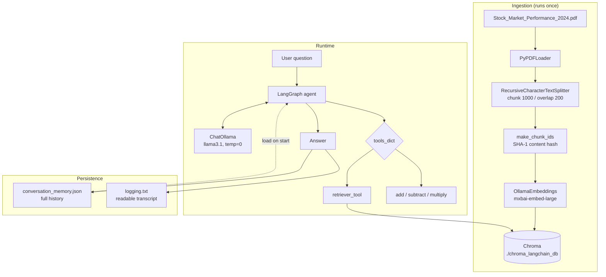
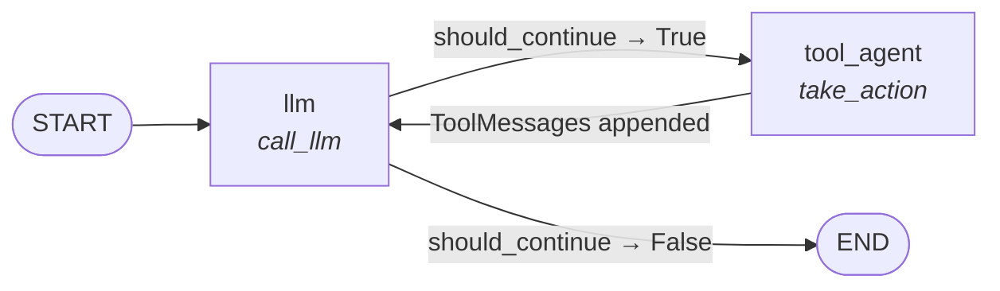
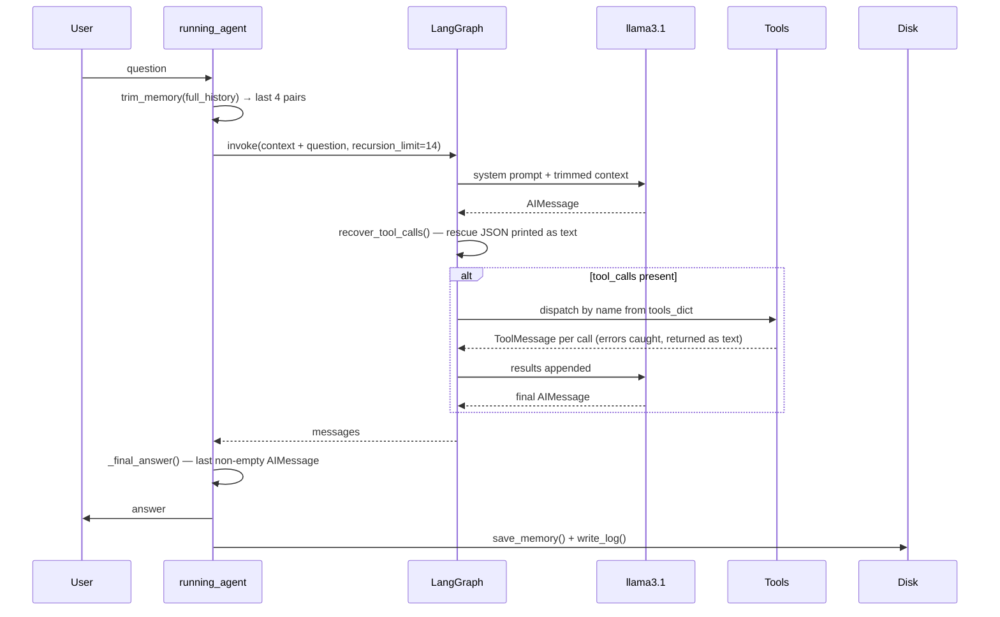

# Local RAG Agent — Multi-Tool + Sliding-Window Memory

A fully local, tool-calling RAG agent built with **LangGraph** and **Ollama**. It answers questions about a PDF using a Chroma vector store, does exact arithmetic through dedicated tools instead of in the model's head, and remembers the conversation across kernel restarts — while keeping the prompt a fixed, small size no matter how long the chat gets.

No API keys. No cloud calls. Everything (LLM + embeddings) runs on your own machine.


---

## Table of contents

- [What this is](#what-this-is)
- [Architecture](#architecture)
- [The agent graph](#the-agent-graph)
- [What happens in one turn](#what-happens-in-one-turn)
- [Setup](#setup)
- [Usage](#usage)
- [How it works](#how-it-works)
  - [1. Ingestion and the vector store](#1-ingestion-and-the-vector-store)
  - [2. The tools](#2-the-tools)
  - [3. The graph](#3-the-graph)
  - [4. Sliding-window memory](#4-sliding-window-memory)
  - [5. Tool-call recovery](#5-tool-call-recovery)
- [Configuration](#configuration)
- [Engineering notes: nine bugs and their fixes](#engineering-notes-nine-bugs-and-their-fixes)
- [Example session](#example-session)
- [Known limitations](#known-limitations)
- [Repo structure](#repo-structure)
- [License](#license)

---

## What this is

The agent combines three things that are usually demoed separately:

| Capability | How it's done |
|---|---|
| **Retrieval over a PDF** | `PyPDFLoader` → recursive chunking → `mxbai-embed-large` embeddings → persisted Chroma collection, exposed to the model as `retriever_tool` |
| **Exact arithmetic** | `add`, `subtract`, `multiply` registered as real tools, so the model never guesses at numbers |
| **Conversation memory** | Full transcript persisted to disk; only the last *N* Human/AI pairs are fed back into the prompt |

The model picks tools **entirely by matching your question against the tool docstrings**. There is no routing logic, no keyword matching, no `if "calculate" in query` anywhere in the code. That is why every docstring states both what the tool is for *and* what it is not for.

Adding a fourth, fifth or tenth tool is a one-line change — `tools = [...]` — because `tools_dict`, `bind_tools()` and the dispatch loop in `take_action` are all derived from that single list. The graph topology never changes.

---

## Architecture



---

## The agent graph

The LangGraph topology is deliberately minimal — two nodes and one conditional edge:



`should_continue` simply checks whether the last `AIMessage` carries any `tool_calls`. If it does, the graph routes to `tool_agent`, which executes **every** requested call (they can be parallel) and appends one `ToolMessage` per call. Control returns to `llm`, which now sees the results and either calls more tools or writes the final answer.

The loop is capped at `RECURSION_LIMIT = 14` hops, which leaves room for a *retrieve → retrieve → subtract → multiply* chain plus a retry.

---

## What happens in one turn



Note what is **not** persisted: intermediate tool calls and tool results stay inside a single `invoke()` and are discarded afterwards. Only the final question/answer pair enters long-term memory. This keeps the stored history clean and the reloaded context free of 4,000-character retrieval dumps.

---

## Setup

### 1. Install Ollama and pull the models

```bash
# https://ollama.com/download
ollama pull llama3.1
ollama pull mxbai-embed-large
```

Make sure the Ollama service is running before you start the notebook.

### 2. Python dependencies

```bash
python -m venv .venv
source .venv/bin/activate        # Windows: .venv\Scripts\activate
pip install -r requirements.txt
```

### 3. Add your PDF

Drop a PDF next to the notebook and update `pdf_path`. The default expects:

```
Stock_Market_Performance_2024.pdf
```

Any PDF works — but the system prompt and the `retriever_tool` docstring both name the stock-market document, so update those two strings to match your source or the model's tool selection will suffer.

---

## Usage

```bash
jupyter notebook AI_Agent_Ollama_6_fixed_additonal_tools.ipynb
```

Run the cells top to bottom. The last cell starts the REPL:

```
=== RAG AGENT (persistent memory, last 4 exchanges used for context) ===
Loaded 9 previous exchange(s) from conversation_memory.json.

What is your question:
```

Type `exit` or `quit` to stop. `Ctrl-C` also exits cleanly — history is already saved after every turn, so nothing is lost.

To start a fresh conversation, delete `conversation_memory.json`.

---

## How it works

### 1. Ingestion and the vector store

The PDF is loaded, split into 1000-character chunks with 200 characters of overlap, and embedded once. The collection is **opened**, not rebuilt:

```python
vectorstore = Chroma(persist_directory=..., collection_name=..., embedding_function=embeddings)
if vectorstore._collection.count() == 0:
    vectorstore.add_documents(documents=pages_split, ids=make_chunk_ids(pages_split))
```

Each chunk's ID is a SHA-1 of its own text plus its source file and page number. Because `add_documents` upserts when IDs are explicit, re-running the cell is a no-op rather than a duplication event. Set `REBUILD_INDEX = True` to wipe and re-embed — do that whenever you change the PDF, the chunk settings, or the embedding model.

Retrieval is plain similarity search with `k=5`.

### 2. The tools

| Tool | Signature | Purpose |
|---|---|---|
| `retriever_tool` | `(query: str) -> str` | Top-5 passages from the PDF, each labelled with its page number |
| `add` | `(a: float, b: float) -> float` | Sums and totals |
| `subtract` | `(a: float, b: float) -> float` | Differences, drops, gains |
| `multiply` | `(a: float, b: float) -> float` | Products, scaling, applying a rate |

`bind_tools()` ships the JSON schema of all four — name, docstring, argument types — with every request. The docstrings are the entire selection mechanism, so each one is written defensively:

> *"Do NOT use it to look up figures — fetch those with `retriever_tool` first, then add them with this."*

and, on the retriever:

> *"Do NOT use it for questions about this conversation itself (the user's name, earlier answers) — that is already in your context."*

### 3. The graph

`AgentState` is a single-key `TypedDict` whose `messages` field is annotated with `add_messages`, so returned messages are appended in order rather than overwriting the list.

`take_action` looks each call's `name` up in `tools_dict` and invokes it inside a `try/except`. An unknown tool name and a raising tool both come back to the model as a `ToolMessage` describing the problem, which lets it retry with different arguments instead of killing the run.

### 4. Sliding-window memory

Two separate things are tracked:

- **`full_history`** — every Human/AI pair ever exchanged, loaded from `conversation_memory.json` at startup and rewritten after every turn.
- **The prompt context** — `trim_memory(full_history)`, i.e. the last `MAX_EXCHANGES = 4` pairs.

The trim is **pair-aware**, not a tail slice. It walks the history grouping `HumanMessage`/`AIMessage` into pairs, discards orphans, and keeps the last N pairs. A flat `memory[-8:]` could begin on an orphaned `AIMessage` — a context window that opens mid-answer with no question attached — whenever alternation broke, which happens with interrupted turns or hand-edited JSON.

`logging.txt` is regenerated from the *complete* history after every turn, so the readable transcript stays intact even though the model only ever sees the last four exchanges.

### 5. Tool-call recovery

Llama 3.1 through Ollama intermittently writes a tool call into its **visible answer** instead of the structured tool-calling channel:

```json
{"name": "retriever_tool", "parameters": {"query": "Nasdaq 2024"}}
```

When that happens `AIMessage.tool_calls` is empty, `should_continue` returns `False`, the graph jumps straight to `END`, and the user sees raw JSON where an answer should be.

`recover_tool_calls()` intercepts it. `_extract_json_objects()` brace-matches top-level `{...}` blocks in the content and parses the valid ones; any object whose `name` matches a registered tool is converted into a proper structured `tool_call`, the JSON is stripped out of the visible text, and a rebuilt `AIMessage` is returned. It accepts `parameters`, `arguments`, or `args` as the argument key, because the model is not consistent about which it emits.

You'll see it fire in the console:

```
[recovered] model emitted 2 tool call(s) as plain text -- converted to real calls.
```

---

## Configuration

All knobs live in the notebook, near the top of their respective sections:

| Setting | Default | Meaning |
|---|---|---|
| `base_llm` model | `llama3.1` | Chat model, `temperature=0` to minimise hallucination |
| `embeddings` model | `mxbai-embed-large` | Embedding model — changing this requires a rebuild |
| `chunk_size` / `chunk_overlap` | `1000` / `200` | Splitter settings |
| `search_kwargs={"k": 5}` | `5` | Chunks returned per retrieval |
| `REBUILD_INDEX` | `False` | Wipe and re-embed the collection |
| `RECURSION_LIMIT` | `14` | Max llm ↔ tool hops per question |
| `MAX_EXCHANGES` | `4` | Human/AI pairs kept in the prompt |
| `MEMORY_FILE` | `conversation_memory.json` | Full persisted history |
| `LOG_FILE` | `logging.txt` | Readable transcript |

---

## Engineering notes: nine bugs and their fixes

This version is a hardened rewrite of an earlier working-but-fragile notebook. Each fix is marked inline in the code as `# FIX n`.

| # | Problem | Fix |
|---|---|---|
| 1 | `Chroma.from_documents` re-embedded and **re-inserted** every chunk on each run, duplicating the corpus and polluting the top-5 results with near-identical passages | Open the collection with `Chroma(...)`, add only when empty, and use deterministic content-hash IDs so re-adding upserts. `REBUILD_INDEX` forces a clean rebuild |
| 2 | `llm = llm.bind_tools(tools)` rebound onto the same name, so re-running the cell wrapped an already-wrapped runnable | Keep `base_llm` separate from the bound `llm`; the cell is now idempotent |
| 3 | Llama 3.1 sometimes printed tool-call JSON as plain text, leaving `tool_calls` empty — the graph ended early and the user saw raw JSON | `recover_tool_calls()` parses stray JSON out of the content and rebuilds a proper `AIMessage` |
| 4 | No recursion guard — a model stuck in a search loop burned LangGraph's default 25 steps | `RECURSION_LIMIT = 14`, passed via config, with `GraphRecursionError` handled gracefully |
| 5 | `trim_memory` used a flat `[-8:]` slice, which can start the window on an orphaned `AIMessage` | Pair-aware trimming: group into Human/AI pairs, drop orphans, keep the last N |
| 6 | A tool raising an exception crashed the whole run | Tool execution wrapped in `try/except`; the error returns to the model as a `ToolMessage` so it can recover |
| 7 | The agent called the retriever for questions about the *conversation* ("what's my name?"), wasting a round-trip on irrelevant chunks | System prompt and tool docstrings now state explicitly when **not** to search |
| 8 | Unused imports (`dotenv`, `ChatPromptTemplate`, `Document`, `ToolNode`) | Removed; `START` is now used instead of `set_entry_point` |
| 9 | The loop crashed on empty input and lost the turn on `Ctrl-C` | Empty input is skipped; `KeyboardInterrupt` saves and exits cleanly |

Beyond the fixes, this version adds the three arithmetic tools, renames the tool node `retriever_agent` → `tool_agent` (it is no longer retrieval-specific), and raises the recursion limit from 8 to 14 to accommodate retrieve-then-compute chains.

---

## Example session

```
=== RAG AGENT (persistent memory, last 4 exchanges used for context) ===
Loaded 9 previous exchange(s) from conversation_memory.json.

What is your question: what did the nasdaq do in 2024?
Calling Tool: retriever_tool with args: {'query': 'nasdaq'}
Result length: 4845
Tools Execution Complete. Back to the model!

=== ANSWER ===
Based on the documents provided, the Nasdaq Composite outpaced the broader
market in 2024, jumping nearly 29% for the year. This was part of a strong
rally in equities, with the S&P 500 delivering roughly a 25% total return...
```

And the recovery path firing on a chained calculation:

```
[recovered] model emitted 2 tool call(s) as plain text -- converted to real calls.
Calling Tool: multiply with args: {'a': 135, 'b': 18}
Result length: 6
Tools Execution Complete. Back to the model!
```

---

## Known limitations

- **Argument chaining is the model's weak point.** Llama 3.1 will occasionally pass a literal placeholder — `{'a': 'result of previous function call'}` — instead of the actual number from the previous tool result. The Pydantic validation error is caught and handed back as a `ToolMessage`, and the model usually recovers on the retry, but a larger or more tool-native model handles multi-step chains considerably better.
- **Numbers arrive as strings.** `{'a': '45', 'b': 3}` is common; Pydantic coerces it, so it works, but it is a reminder that the schema is a suggestion to the model, not a contract.
- **The retriever gets called for off-topic questions.** Ask it for a joke and it will still search the PDF first before answering from its own weights. Tightening the system prompt helps; it doesn't eliminate it.
- **`vectorstore._collection.count()` touches a private attribute.** It works, but it isn't part of the public LangChain surface and may break on a Chroma upgrade.
- **Inherited a polluted store?** If the collection count is a clean multiple of your chunk count (e.g. 96 chunks from a 24-chunk PDF), you are looking at duplication from a pre-fix run. Set `REBUILD_INDEX = True` once.
- **Single-user, single-session.** Memory is one flat JSON file with no thread or user ID. A multi-user version would want LangGraph's checkpointer instead.

---

## Repo structure

```
.
├── AI_Agent_Ollama_6_fixed_additonal_tools.ipynb   # the agent
├── Stock_Market_Performance_2024.pdf               # source document (add your own)
├── requirements.txt
├── .gitignore
├── README.md
│
├── chroma_langchain_db/        # generated — persisted vector store (gitignored)
├── conversation_memory.json    # generated — full history (gitignored)
└── logging.txt                 # generated — readable transcript (gitignored)
```

---

## License

MIT — see [LICENSE](LICENSE).
